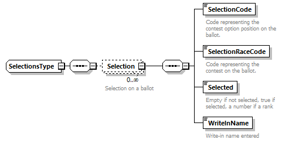

# Data Formats

This section describes the data formats used by the Remote Ballot Marker (`RBM`).

<!-- TOC -->

- [Data Formats](#data-formats)
    - [RBM Format](#rbm-format)
    - [EML 410](#eml-410)
    - [Selections Ballot Record Format](#selections-ballot-record-format)

<!-- /TOC -->

## RBM Format

The RBM Format is a container format, encapsulating the following:

- EML 410 instance for a single ballot
- Selections Ballot Record (`SBR`)

> The `SBR` is not provided by the election jurisdiction, instead it is generated by the `RBM` during the ballot marking process.

For more information on the RBM format, see the `xsd/hr-rbm.xsd`.

## EML 410

An [extended version](./EML-410_extensions.md) of EML 410 is the primary format used by the RBM.

> RBM supports vanilla EML 410. However, to take advantage of advanced rendering features, extensions must be used.

## Selections Ballot Record Format

The Selections Ballot Record (`SBR`) is a highly simplified format containing only the codes necessary to correlate them to indications on a ballot.

The structure of this format is given below:

> `RBM` currently generates a `Selection` for every potential effective indication on the ballot, even if there is no indication present. Refer to the `Selected` element to determine if the selection is indicated.
