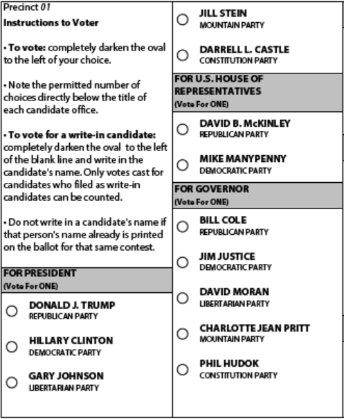
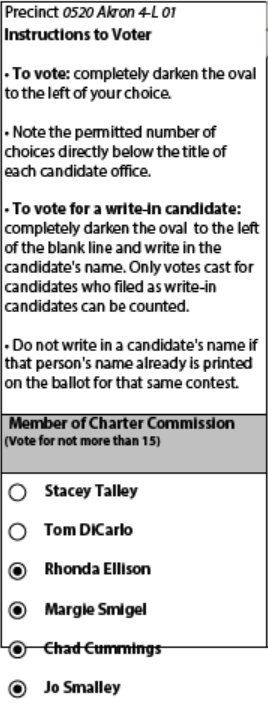
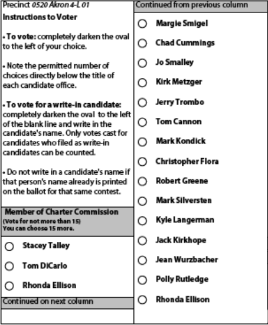

# Ballot Rendering

This document describes how ballots are rendered and how rendering can be controlled.

<!-- TOC -->

- [Ballot Rendering](#ballot-rendering)
    - [Basic Rendering](#basic-rendering)
    - [Adhesion](#adhesion)
    - [Avoiding Column Splitting](#avoiding-column-splitting)
        - [Content Overflow](#content-overflow)
            - [Overflow Leaders and Trailers](#overflow-leaders-and-trailers)
        - [Ballot Measures](#ballot-measures)
            - [Orphan / Widow Control](#orphan--widow-control)
            - [Paragraph Control](#paragraph-control)

<!-- /TOC -->

## Basic Rendering

Non boilerplate content is laid down in `content areas`. In the default template there are three content areas, one per column. Content is laid down in English reading order, from top to bottom, left to right.

## Adhesion

The default template enforces basic ballot layout practices that no one could conceivably wish to violate. These rules dictate that certain subforms should be laid down together, in the same content area. The following objects are adhered:

- A ballot measure header and its associated text
- A contest header and its contest options

> Adhesion does not enforce that all content appear together, only that *some* content appear together. It is truly glue at the edges!

## Avoiding Column Splitting

Avoiding splitting of contest content is a good ballot layout practice and can be controlled, to a point.

`RBM` adds directives that can control the splitting of content across areas (see [Column and Page Breaking](EML-410_extensions.md#column--page-breaking)). These directives, when applied attempt to keep content together.

Consider a contest with no directives.



As we can see, the `FOR PRESIDENT` contest is broken up between two columns. To avoid this outcome, we can add the following directive to the contest.

```xml
<KeepIntact Target="BallotChoices">contentArea</KeepIntact>
```

### Content Overflow

The solution above works for the vast majority of cases, but not all. Some contests are larger than any content area they can be placed on. This results in content overflow.



#### Overflow Leaders and Trailers

If a column or page break is unavoidable, a subform can appear right before the break (the `trailer`), and right after the break (the `leader`) to indicate to the voter to refer to the next or previous page.

> A leader/trailer appear will only appear for the first break of any contest. Put differently, if a contest splits across more than two columns, a leader/trailer will appear one the first and second column.

`RBM` adds directives that can control the emission of leaders and trailers (see [Leaders and Trailers](./EML-410_extensions.md#leaders-and-trailers)



### Ballot Measures

Ballot measures can be exceedingly long, and keeping the ballot measure text in a single content area may be impossible. CSS styles can be used to control where ballot measure text can be split, and how it can be split.

#### Orphan / Widow Control

Because ballot styles can vary drastically in content, it can be very hard to predict how each ballot will be laid out, and if ballot layout best practices might be violated. Orphan and widow control both work similarly to control how content should be split.

#### Paragraph Control

It may not be desirable to break up the content of a paragraph. In this case, you can use the following CSS style attributes. 

| name              | value                      | default | description                                                | 
|-------------------|----------------------------|---------|------------------------------------------------------------| 
| page-break-after  | 'auto', 'avoid', 'always' | auto    | Controls page breaking after the paragraph.                | 
| page-break-before | 'auto', 'avoid', 'always' | auto    | Controls page breaking before the paragraph.               | 
| page-break-inside | 'auto', 'avoid'            | auto    | Controls page breaking between lines within the paragraph. | 


> Even though these CSS extensions refer to breaking the "page", in reality to apply to content areas.

> Refer to the XFA Specification (pp. 1193-1194) for additional details.
